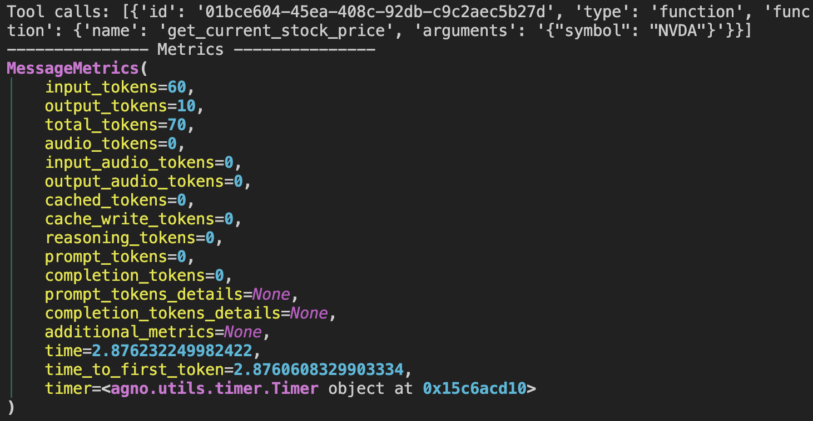
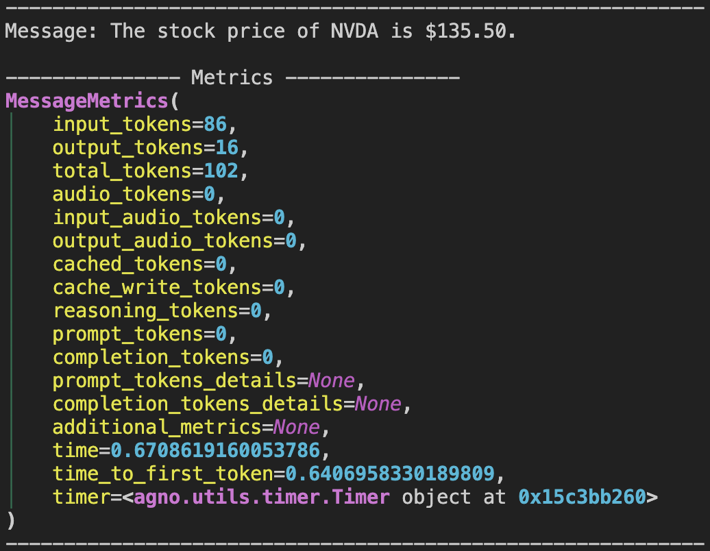
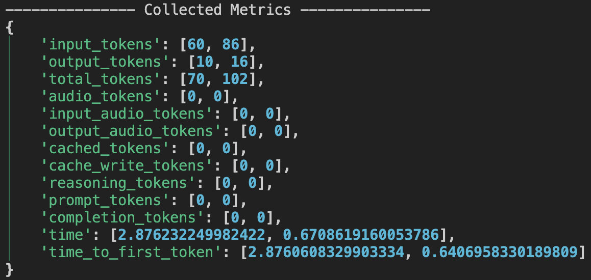

## 概述
在Agno中运行智能体时，所获得的响应（**RunResponse**）包含关于此次运行的详细指标。这些指标有助于理解资源使用情况（例如**令牌用量**和**时间**）、性能以及模型与工具调用的其他方面。

指标划分为多个层级：
- **每条消息**：每条消息（助手消息、工具消息等）均有专属指标。
- **每次工具调用**：每次工具执行均有专属指标。
- **聚合指标**：`RunResponse`会汇总运行中所有消息的指标。

<Note>
指标存储位置
- `RunResponse.metrics`：整个运行的聚合指标，以字典形式呈现。
- `ToolExecution.metrics`：每次工具调用的指标。
- `Message.metrics`：每条消息（助手消息、工具消息等）的指标。
</Note>

## 使用示例
假设有一个执行任务的智能体，您希望在运行后分析其指标。以下是访问并打印指标的方法：

运行以下代码创建智能体并按如下配置执行：
```python
from typing import Iterator

from agno.agent import Agent, RunResponse
from agno.models.google import Gemini
from agno.tools.yfinance import YFinanceTools
from rich.pretty import pprint

agent = Agent(
    model=Gemini(id="gemini-2.0-flash-001"),
    tools=[YFinanceTools(stock_price=True)],
    markdown=True,
    show_tool_calls=True,
)

agent.print_response(
    "What is the stock price of NVDA", stream=True
)

# 按消息打印指标
if agent.run_response.messages:
    for message in agent.run_response.messages:
        if message.role == "assistant":
            if message.content:
                print(f"Message: {message.content}")
            elif message.tool_calls:
                print(f"Tool calls: {message.tool_calls}")
            print("---" * 5, "Metrics", "---" * 5)
            pprint(message.metrics)
            print("---" * 20)

# 打印整个运行过程的聚合指标
print("---" * 5, "Collected Metrics", "---" * 5)
pprint(agent.run_response.metrics)
# 输出整个会话的聚合指标
print("---" * 5, "Session Metrics", "---" * 5)
pprint(agent.session_metrics)
```

您将看到包含以下信息的输出：
### 工具执行指标
本节提供每次工具执行的指标，包含单个工具调用的资源使用详情和性能数据。



### 消息指标
此处可查看智能体每条消息响应的指标。所有"assistant"响应都将包含此类指标，帮助理解消息层级的性能和资源使用情况。



### 聚合运行指标
聚合指标提供整个运行的全局视图，包含所有消息和工具调用的摘要，展现智能体的整体性能和资源使用情况。



会话指标同理，您可查看会话中所有运行的聚合指标，从而洞察智能体在多次运行中的整体性能和资源使用情况。

## 指标聚合方式
- **每条消息**：每条消息（助手消息、工具消息等）拥有独立的指标对象。
- **运行层级**：RunResponse.metrics为字典结构，每个键（如input_tokens）映射到运行中所有助手消息的值列表。
- **会话层级**：`SessionMetrics`（参见`agent.session_metrics`）会聚合会话中所有运行的指标。

## `MessageMetrics` 参数
<Snippet file="message_metrics_params.mdx" />